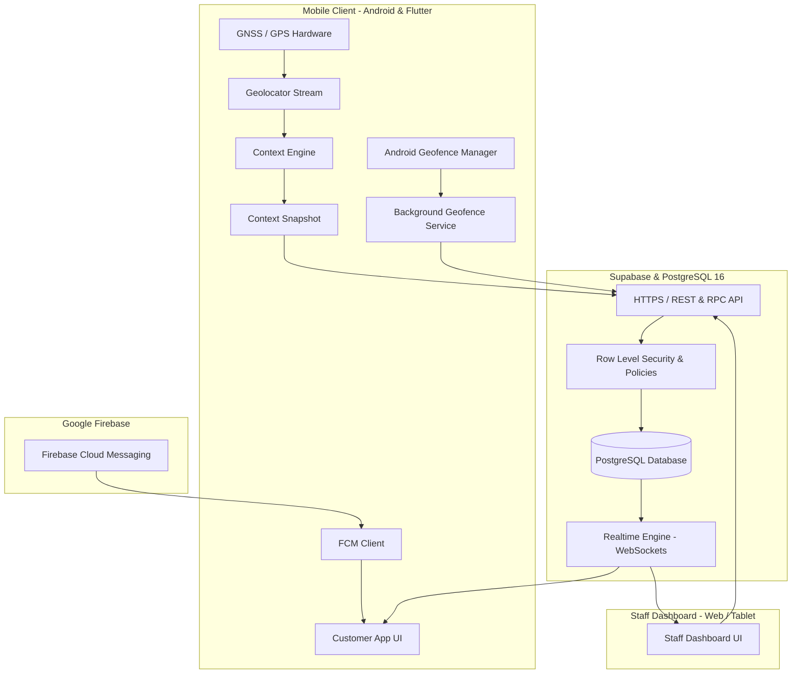

# QueueLess: Context-Aware Autonomous Queuing & Table Turnover System
## Mobile & Ubiquitous Computing (MUC) — Architectural & Design Report

---

### Executive Summary

Traditional restaurant and service queuing systems rely heavily on **explicit human interaction**: physical queue lines, buzzers with limited radio range, and manual staff inputs to manage seat turnovers. These traditional systems produce cognitive friction, spatial bottlenecks, and frequent human errors (e.g. forgotten table departures leading to phantom occupancy).

**QueueLess** is an autonomous, context-aware mobile and ubiquitous computing system built to eliminate explicit queuing friction. Utilizing **Calm Technology**, **Proactive Micro-Location Sensing**, **Native Background Geofencing**, and **Bidirectional Context Negotiation**, QueueLess allows customers to wait anywhere in the city while dynamically computing travel times, proactively displaying arrival check-in passes, and autonomously freeing up tables upon physical departure.

---

## 1. Theoretical Grounding in Mobile & Ubiquitous Computing (MUC)

### 1.1 Mark Weiser’s Calm Technology & Implicit Interaction
> *"The most profound technologies are those that disappear. They weave themselves into the fabric of everyday life until they are indistinguishable from it."* — Mark Weiser (1991)

| Traditional Queuing (Explicit Interaction) | QueueLess (Calm / Implicit Computing) |
| :--- | :--- |
| Customer must stand in physical line or stare at a screen waiting for numbers. | System runs in background; calculates when the user needs to start walking and alerts them only when necessary. |
| Host must manually click "Departed" on a terminal after a customer leaves. | **Autonomous Spatial Departure**: Hardware geofences sense when the customer walks away from the venue and automatically free up table capacity. |
| Customer fumbles through menus to find their check-in ticket when walking in. | **Ambient Arrival Prompt**: The app senses entry into the 100m arrival boundary and automatically surfaces a 1-tap Check-In Pass. |

### 1.2 Anind Dey’s Context-Aware Computing Framework
According to Dey & Abowd (2000), context is any information that can be used to characterize the situation of an entity:

1. **Primary Context**:
   - **Location**: Continuous GNSS coordinates $(lat, lng)$ and device accuracy.
   - **Identity**: Cryptographically verified anonymous customer session (`auth.uid()`) and assigned table (`table_label`).
   - **Time**: Ticket timestamp (`joined_at`), call time (`called_at`), and turnover pace.
   - **Activity**: Walking/transit velocity $(v \approx 1.25\text{ m/s})$ and dining state (`seated`).

2. **Secondary (Derived) Context**:
   - **Haversine Spatial Distance**: $d = 2R \arcsin\left(\sqrt{\sin^2(\Delta \phi/2) + \cos\phi_1 \cos\phi_2 \sin^2(\Delta \lambda/2)}\right)$
   - **Dynamic Travel ETA**: $T_{\text{travel}} = \lceil d / (v \times 60) \rceil$
   - **Proximity Bands**:
     - $\text{Far } (d > 800\text{m})$
     - $\text{Approaching } (100\text{m} < d \le 800\text{m})$
     - $\text{Near / Arrived } (d \le 100\text{m})$
   - **Departure Recommendation ("Leave Now" Trigger)**:
     $$\text{ShouldLeaveNow} \iff T_{\text{travel}} + T_{\text{safetyBuffer}} \ge T_{\text{estimatedWait}}$$

### 1.3 Adaptive Temporal Scheduling & Context Negotiation
In ubiquitous environments, dynamic factors (e.g. traffic jams, delayed parking) can disrupt strict scheduling. QueueLess implements **bidirectional context negotiation**:
- When a customer is called, an arrival grace window is initiated.
- If unexpected delay occurs, the customer negotiates extra time with 1 tap (**"Running Late +5m"**).
- The system dynamically recalculates venue throughput and informs the host, preventing unfair no-show cancellations.

---

## 2. System Architecture & Component Design



---

## 3. Sensing & Energy-Efficiency Strategy

Continuous GPS polling drains device batteries within hours. QueueLess uses a **multi-tiered sensing hierarchy**:

```
+-------------------------------------------------------------------------+
| Level 1: Native Geofencing (Zero CPU / Battery Efficient)              |
| Uses Android Google Play Services Hardware Geofencing.                  |
| Device CPU sleeps until the hardware radio detects boundary crossings. |
+-------------------------------------------------------------------------+
                                    │ (When Approaching / Active)
                                    ▼
+-------------------------------------------------------------------------+
| Level 2: Fused Location Stream (Adaptive GPS/Wi-Fi/Cell)                |
| Active only while waiting in queue with location toggled.               |
| Calculates real-time Haversine distance and travel time.               |
+-------------------------------------------------------------------------+
                                    │ (Privacy Boundary)
                                    ▼
+-------------------------------------------------------------------------+
| Level 3: Privacy-by-Design Event Logging                                |
| Raw GPS coordinates NEVER leave the device.                             |
| Only semantic events ('outer_geofence_entered', 'seated_guest_departed')|
| are sent to the cloud database.                                         |
+-------------------------------------------------------------------------+
```

---

## 4. Key Implementation Artifacts

| Component | File Path | Ubiquitous Computing Purpose |
| :--- | :--- | :--- |
| **Context Engine** | [`lib/domain/context_engine.dart`](file:///c:/MobileComputing/queueless/lib/domain/context_engine.dart) | Pure functional algorithm computing Haversine distance, proximity bands, and leave-now recommendations. |
| **Background Geofencing** | [`lib/services/background_geofence_service.dart`](file:///c:/MobileComputing/queueless/lib/services/background_geofence_service.dart) | Registers native Android hardware geofences for outer (800m) and arrival (100m) boundaries. |
| **Arrival Ambient Banner** | [`lib/customer/widgets/arrival_proximity_banner.dart`](file:///c:/MobileComputing/queueless/lib/customer/widgets/arrival_proximity_banner.dart) | Proactive UI that automatically displays check-in pass when entering the 100m perimeter. |
| **Auto-Departure Migration** | [`supabase/migrations/202608240005_auto_departure.sql`](file:///c:/MobileComputing/queueless/supabase/migrations/202608240005_auto_departure.sql) | SQL procedures detecting geofence exit events and releasing seated tables automatically. |
| **Delay Reporting Migration** | [`supabase/migrations/202608240006_customer_delay.sql`](file:///c:/MobileComputing/queueless/supabase/migrations/202608240006_customer_delay.sql) | RPC handling customer delay negotiation and temporal grace extensions. |
| **In-App MUC Simulator** | [`lib/customer/widgets/context_simulator_sheet.dart`](file:///c:/MobileComputing/queueless/lib/customer/widgets/context_simulator_sheet.dart) | Interactive demonstration tool for simulating proximity states and boundary exits during presentations. |

---

## 5. Verification & Test Suite

The project includes an automated test suite verifying both algorithmic logic and widget state transitions:

```powershell
flutter test
```

### Verified Test Cases:
1. `classifies a customer inside the arrival boundary as near`
2. `recommends leaving when travel plus buffer reaches wait time`
3. `demo repository joins and cancels a customer ticket`
4. `ticket maps database no_show status and table label correctly`
5. `customer can report delay and request grace extensions`
6. `staff can assign a table and seat an arrived party`
7. `seated customer is auto-departed on geofence exit event`
8. `QR payload round-trips ticket, venue, and nonce`
9. `rejects non-QueueLess QR values`
10. `customer can enter the queue flow`
11. `customer can navigate history and settings`
12. `staff dashboard shows the live queue`

---

## 6. University Presentation & Defense Guide (Q&A)

### Q1: Why is this project classified under Ubiquitous Computing rather than a normal web/mobile app?
> **Answer**: A normal app requires users to manually refresh, stare at ticket numbers, and manually tap buttons at every step. QueueLess embodies **Calm Technology** and **Context-Awareness**: it senses the user’s physical environment (spatial location, proximity, movement, and venue departure) and takes proactive actions in the background without demanding explicit human attention.

### Q2: How does the system protect user privacy?
> **Answer**: QueueLess follows **Privacy-by-Design**. Raw GPS latitude and longitude are processed locally on the client device. The server only receives discrete, high-level context events (e.g. `outer_geofence_entered` or `seated_guest_departed`), ensuring that a customer’s continuous location trail is never stored on the server.

### Q3: How do you handle battery consumption with background location?
> **Answer**: Rather than continuously running power-hungry GPS polling, QueueLess registers hardware geofences with Android’s `GeofenceManager`. The operating system handles boundary triggers using cell towers and Wi-Fi beacons at the hardware level, waking the app only when a boundary crossing occurs.
